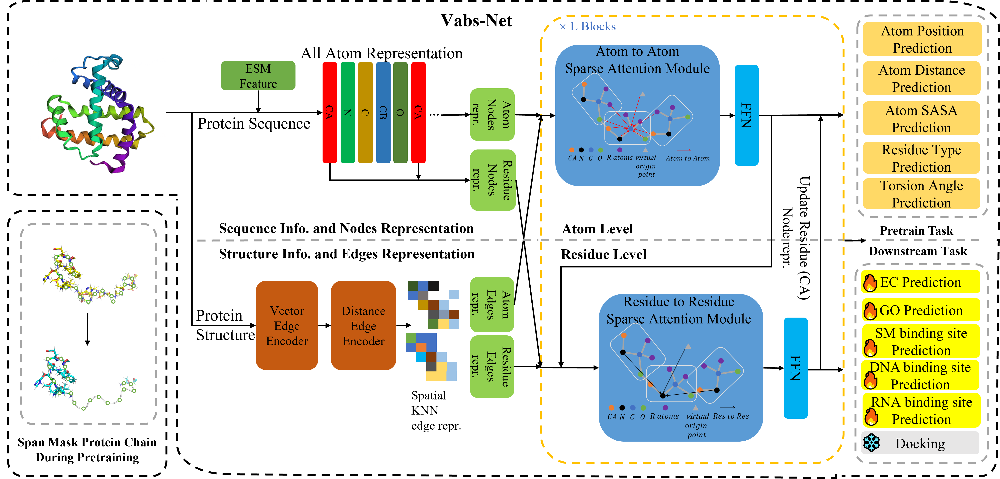

# Vabs-Net
Vabs-Net: Pre-Training Protein Bi-level Representation Through Span Mask Strategy On 3D Protein Chains

The repository is an official implementation of [Pre-Training Protein Bi-level Representation Through Span Mask Strategy On 3D Protein Chains](https://arxiv.org/abs/2402.01481)


## Environment installation

```bash
cd Vabs-Net
bash env.sh
```
## Small molecule binding site dataset
In this paper, we also proposed a new small molecule binding site dataset, which can be found in [BindingSiteDataset4VabsNet](https://huggingface.co/datasets/Heisenburger2000/BindingSiteDataset4VabsNet)

## Example of reproduction

### Pre-train

```bash
cd Vabs-Net
bash reproduce_pretrain.sh
```
### Finetune
```bash
cd Vabs-Net
bash reproduce_finetune.sh
```
## Cite
If you want to cite this paper:
```bash
@article{zhao2024multi,
  title={Multi-level protein pre-training with Vabs-Net},
  author={Zhao, Jiale and Zhuang, Wanru and Song, Jia and Li, Yaqi and Lu, Shuqi},
  journal={arXiv preprint arXiv:2402.01481},
  year={2024}
}
```
